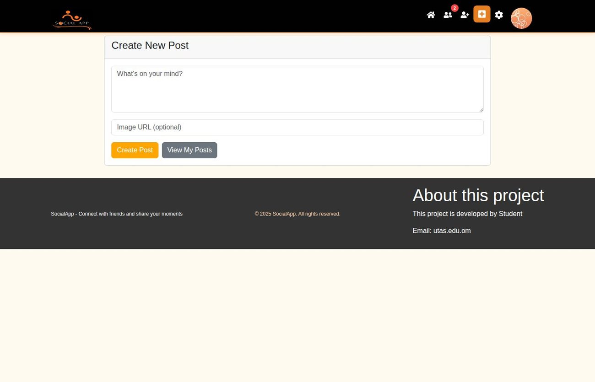
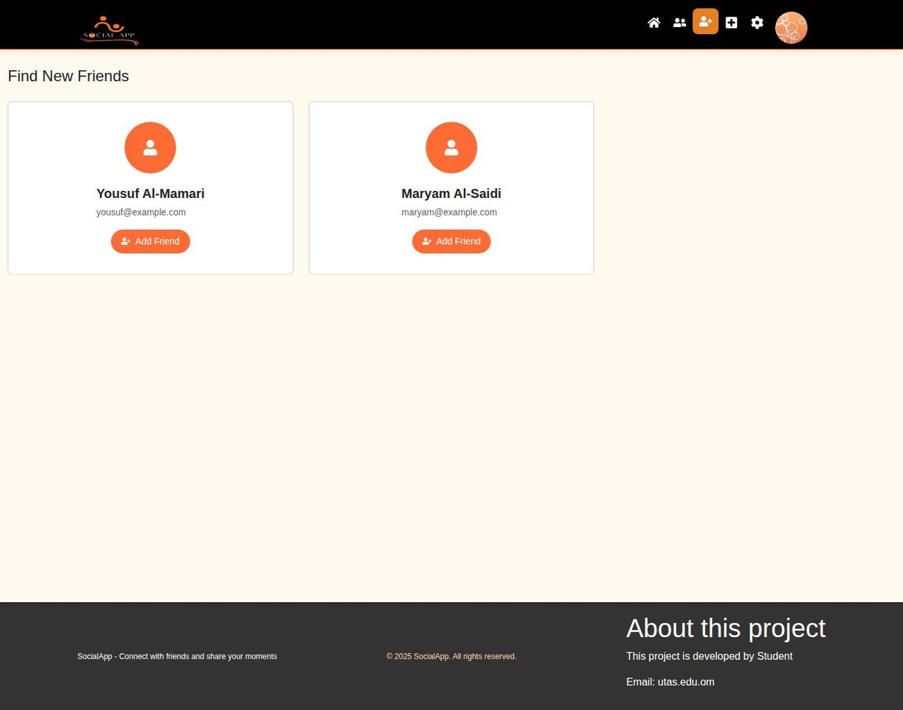
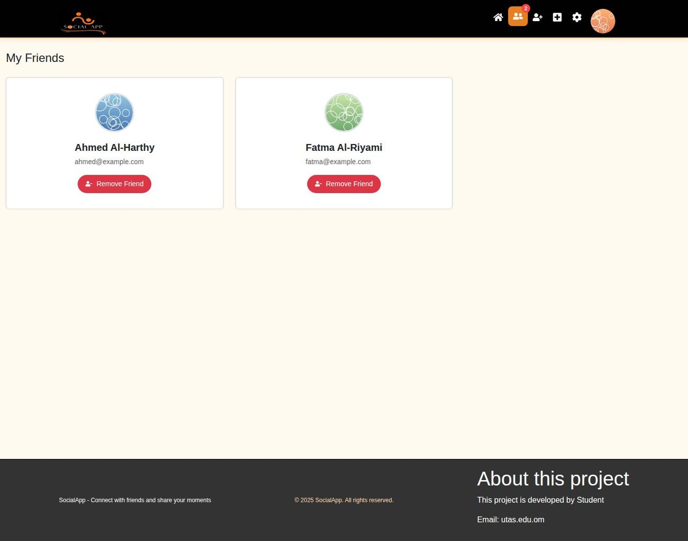
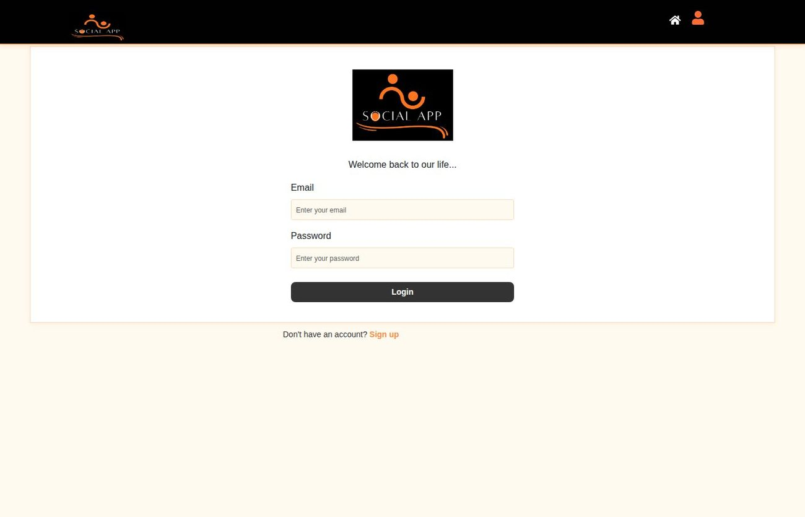
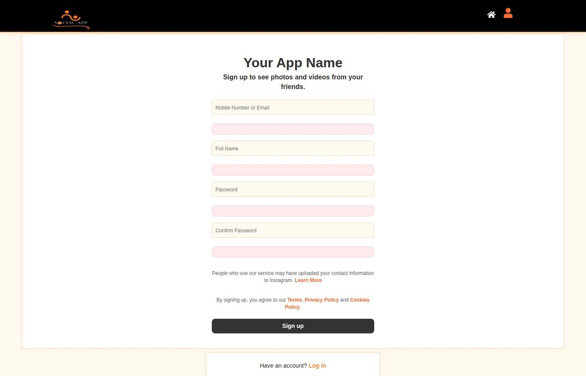

# Social Media App

A full-stack social network built with the MERN stack. Users register, post updates, like and comment on each other's posts, find people, and build a friends list.


---

## What it does

A working social feed. A visitor can browse posts without an account; once registered they get a profile, can publish their own posts, react to other people's, and manage a friends list.

The React frontend keeps all application state in Redux Toolkit — three slices for users, posts, and friends — and talks to an Express REST API backed by MongoDB Atlas.

## Screenshots

| Feed | Create a post |
| --- | --- |
|  |  |

| Find friends | My friends |
| --- | --- |
|  |  |

| Login | Register |
| --- | --- |
|  |  |

*Screenshots use sample accounts and posts, not real user data.*

---

## Features

**Accounts**
- Register with name, email, and password
- Passwords hashed with bcrypt before storage
- Login, editable profile with bio and profile picture URL

**Posts**
- Create, edit, and delete your own posts
- Public feed of all posts, plus a "my posts" view
- Like and unlike
- Threaded comments with author and timestamp

**Social**
- Find friends — browse users you are not connected to yet
- Add and remove friends
- Friends list per user

**Frontend**
- Redux Toolkit with `createAsyncThunk` for every API call
- Form validation with React Hook Form and Yup schemas
- Bootstrap 5 / Reactstrap responsive layout
- Relative timestamps via Moment
- Component tests with Vitest and React Testing Library

---

## Tech stack

| Layer | Technology |
| --- | --- |
| Frontend | React 18, React Router 6, Redux Toolkit, Axios |
| Forms | React Hook Form + Yup |
| UI | Bootstrap 5, Reactstrap, React Icons |
| Backend | Node.js, Express 5 (ES modules) |
| Database | MongoDB Atlas with Mongoose 8 |
| Passwords | bcrypt |
| Testing | Vitest, React Testing Library, jsdom |

---

## Project structure

```
social-media-app/
├── client/                       # React frontend
│   └── src/
│       ├── Components/           # Header, Footer, Posts, Profile, Login, ...
│       ├── Features/             # Redux slices: UserSlice, PostSlice, FriendSlice
│       ├── Store/Store.js        # configureStore
│       ├── Validations/          # Yup schemas for post and user forms
│       ├── Tests/                # Vitest component tests
│       └── App.js                # Routes
└── server/                       # Express API
    ├── index.js                  # All routes and Mongo connection
    └── Model/
        ├── UserModel.js          # name, email, password, bio, friends[]
        └── PostModel.js          # userId, content, likes[], comments[]
```

---

## Getting started

### Prerequisites
- Node.js 18 or newer
- A MongoDB database — a free [MongoDB Atlas](https://www.mongodb.com/atlas) cluster works

### 1. Clone

```bash
git clone https://github.com/SoftwereEngenOMBettol/social-media-app.git
cd social-media-app
```

### 2. Backend

Create `server/.env`:

```env
MONGODB_URI=mongodb+srv://<user>:<password>@<cluster>.mongodb.net/SocialAppDb
PORT=3001
```

Then:

```bash
cd server
npm install
npm start
```

The API runs at <http://localhost:3001>.

> Note: `package.json` runs `nodemon index.js`, but the installed dependency is `nodeman` (a different package). If `npm start` fails, run `npm install --save-dev nodemon`, or start it directly with `node index.js`.

### 3. Frontend

In a second terminal:

```bash
cd client
npm install
npm start
```

The app opens at <http://localhost:3000>.

### Running the tests

```bash
cd client
npm test
```

---

## API reference

Base URL: `http://localhost:3001`

### Users

| Method | Endpoint | Purpose |
| --- | --- | --- |
| `POST` | `/registerUser` | Create an account — `{ name, email, password }` |
| `POST` | `/login` | Log in — `{ email, password }` |
| `GET` | `/user/:userId` | Fetch one user profile |
| `PUT` | `/user/:userId` | Update name, bio, or profile picture |

### Posts

| Method | Endpoint | Purpose |
| --- | --- | --- |
| `GET` | `/posts` | All posts, newest first |
| `GET` | `/my-posts/:userId` | Posts by one user |
| `POST` | `/posts/create` | Create a post — `{ userId, content, image }` |
| `PUT` | `/edit/:postId` | Edit post content |
| `DELETE` | `/delete/:postId` | Delete a post |
| `POST` | `/:postId/like` | Toggle a like |
| `POST` | `/:postId/comment` | Add a comment — `{ userId, text }` |

### Friends

| Method | Endpoint | Purpose |
| --- | --- | --- |
| `GET` | `/findFriends/:userId` | Users not yet friends with this user |
| `POST` | `/addFriend` | Add a friend |
| `DELETE` | `/myfriends/remove` | Remove a friend |

### Example

```bash
# Register
curl -X POST http://localhost:3001/registerUser \
  -H "Content-Type: application/json" \
  -d '{"name":"Sara","email":"sara@example.com","password":"secret123"}'

# Create a post
curl -X POST http://localhost:3001/posts/create \
  -H "Content-Type: application/json" \
  -d '{"userId":"<mongo_object_id>","content":"Hello world!"}'
```

---

## Data models

**User**

| Field | Type | Notes |
| --- | --- | --- |
| `name` | String | Required |
| `email` | String | Required, unique |
| `password` | String | bcrypt hash |
| `profilePicture` | String | Image URL |
| `bio` | String | |
| `friends` | ObjectId[] | References to other users |
| `friendRequests` | ObjectId[] | Declared but not yet used by any route |
| `createdAt` | Date | |

**Post**

| Field | Type | Notes |
| --- | --- | --- |
| `userId` | ObjectId | Author, required |
| `content` | String | Required |
| `image` | String | Image URL |
| `likes` | ObjectId[] | Users who liked it |
| `comments` | Object[] | `{ userId, text, createdAt }` |
| `createdAt` | Date | |

---

## Known issues

Kept visible so anyone reading the code knows what still needs doing.

- [ ] **The API has no authentication.** Login verifies the password but issues no token, and no route checks who is calling. Anyone can edit or delete any post or profile by sending its ID. Adding JSON Web Tokens plus an `auth` middleware is the most important next step.
- [ ] **The client hardcodes `http://localhost:3001`** in all four Redux slices, so the deployed build cannot reach the deployed API. Replace every occurrence with `process.env.REACT_APP_SERVER_URL`.
- [ ] **`GET /myfriends/:userId` does not exist on the server.** `FriendSilce.js` calls it to populate the My Friends page, but `index.js` only defines `DELETE /myfriends/remove`, so the page stays empty. Add the missing route.
- [ ] `client/.env` contains shell commands rather than plain `KEY=value` lines, and the variable it defines is never read anywhere in the code.
- [ ] `server/node_modules/` (23 MB) is committed. There is no `.gitignore` at the repo root or in `server/`.
- [ ] Duplicate and misspelled files that should be consolidated:
  - `Features/PostSilce.js`, `Features/PostSlice.js`, and a third copy at `src/PostSilce.js`
  - `Validations/UserValidations.js` and `Validations/UserValidaton.js`
  - `Components/MyFrinds.js` (should be `MyFriends.js`)
- [ ] Routes under `/settings/:user_id`, `/profile/:user_id`, and similar are labelled "protected" in `App.js` but have no route guard — visiting the URL directly works.
- [ ] `friendRequests` exists on the User model but no endpoint uses it; friends are added instantly with no request/accept flow.
- [ ] `server/package.json` depends on `nodeman` and `mongod`, which are not the intended `nodemon` and `mongodb` packages.
- [ ] No image upload — `image` and `profilePicture` accept URLs only.

---

## Security

Before this is used by anyone real:

- Move the MongoDB connection string entirely to `.env` and delete the fallback value from `index.js`
- Add JWT authentication and protect every write endpoint
- Verify that the requesting user owns a post before allowing edit or delete
- Restrict CORS to the actual frontend domain
- Add rate limiting on `/login` and `/registerUser`

---

## License

MIT

## Author

**SoftwereEngenOMBettol** — [GitHub profile](https://github.com/SoftwereEngenOMBettol)
